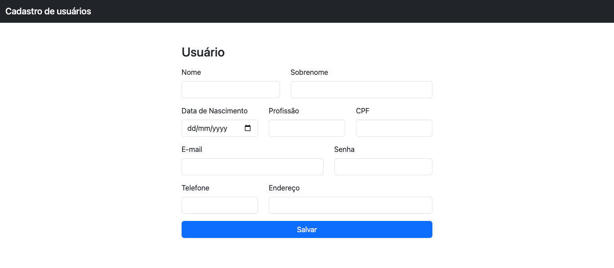
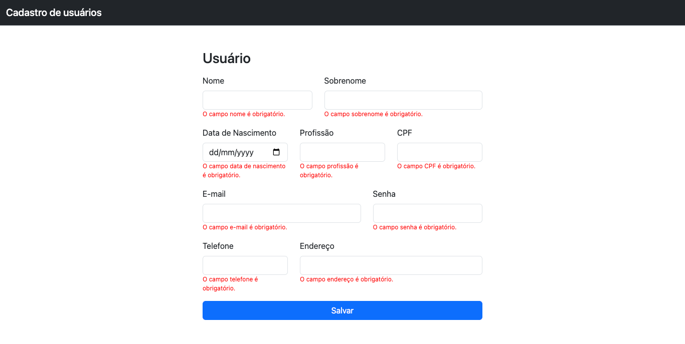

Aula 02

Vimos na aula anterior como interagir com os elementos de um documento HTML.
Para aplicar e aprofundar os conceitos apresentados, vamos propor uma atividade **em grupo**.

---

### Atividade 1

1. Criar um formulário de cadastro de usuários, seguindo a estrutura apresentada a seguir.

   - Deverá ser exibida uma mensagem de "campo obrigatório" ao clicar no botão enviar, nos campos que estiverem sem conteúdo.
   - Caso todos os campos estiverem preenchidos, montar um payload com os valores dos campos, que seriam enviados ao backend
   - Sugestão: usar o bootstrap

---

```js
const payload = {
  name,
  surname,
  birthDate,
  profession,
  documentNumber,
  email,
  password,
  phone,
  address,
};
```

---



---



---

## Como deixar um formulário ou um site reativo usando JS Vanilla?

Eventos DOM (Document Object Model) são mecanismos do JavaScript que permitem aos desenvolvedores manipular e responder a eventos que ocorrem em elementos HTML. Esses eventos podem ser desde um clique do mouse até o envio de um formulário. Ao entender como os eventos DOM funcionam, os desenvolvedores podem criar interações dinâmicas e responsivas em suas páginas da web.

---

## Tipos de eventos DOM

Existem vários tipos de eventos DOM disponíveis para uso em JavaScript. Alguns dos mais comuns incluem:

---

- **_click:_** acionados quando um elemento é clicado.

```js
element.addEventListener("click", (event) => {
  // do something
});
```

---

- **_keydown:_** acionados quando uma tecla é pressionada no teclado.

```js
element.addEventListener("keydown", (event) => {
  // do something
});
```

---

- **_keyup:_** acionados quando uma tecla é liberada no teclado.

```js
element.addEventListener("keyup", (event) => {
  // do something
});
```

---

- **_submit:_** acionados quando um formulário é submetido.

```js
element.addEventListener("submit", (event) => {
  // do something
});
```

---

- **_change:_** acionados quando um campo de entrada é alterado.

```js
element.addEventListener("change", (event) => {
  // do something
});
```

---

- **_mouseover:_** acionados quando um mouse é movido sobre um elemento.

```js
element.addEventListener("mouseover", (event) => {
  // do something
});
```

---

- **_mouseout:_** acionados quando um mouse é movido para fora de um elemento.

```js
element.addEventListener("mouseout", (event) => {
  // do something
});
```

---

- **_load:_** acionado quando uma página é carregada.

```js
element.addEventListener("load", (event) => {
  // do something
});
```

---

- **_focus:_** acionado quando um elemento recebe foco.

```js
element.addEventListener("focus", (event) => {
  // do something
});
```

---

- **_blur:_** acionado quando um elemento perde o foco.

```js
element.addEventListener("blur", (event) => {
  // do something
});
```

---

### Atividade 2

Utilizando o que foi construído no exercício anterior, aplicar as regras de validação logo após o foco ser retirado do campo, seja pra exibir a mensagem de erro, seja para fazê-la desaparecer, quando o campo estiver preeenchido.

---

### Atividade 3

Aplicar outras regras de validação nos campos, utilizando o JavaScript, a saber:

- Os campos nome, sobrenome, profissão precisam ter, ao menos dois caracteres;

- A data de nascimento deverá ser anterior à data atual;

- O campo CPF deverá ter 11 caracteres;

- O campo senha deverá ter, ao menos, 8 caracteres;

- O campo telefone deverá ter, no mínimo 10 e no máximo 11 caracteres.

---

### Atividade 4

Exibir os usuários cadastrados em uma lista no DOM.

---

## Links Úteis

- [Lista de eventos DOM em JavaScript](https://awari.com.br/lista-de-eventos-dom-em-javascript/)
