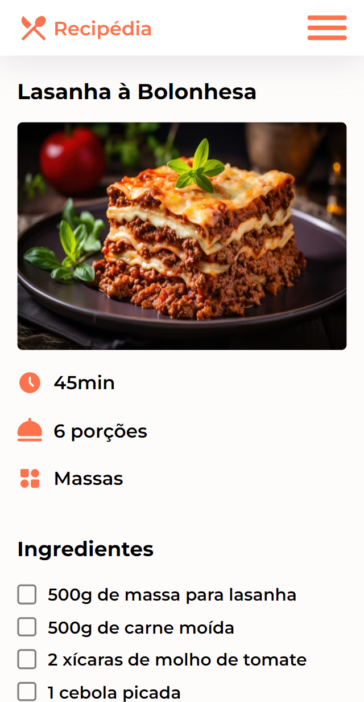

# Recipédia

Este é um projeto de um site de receitas feito em React com TypeScript, desenvolvido para o projeto final do modulo 1 de React

## Funcionalidades

- **Listagem de Receitas na Home**: A página inicial exibe uma lista de receitas em cards, mostrando a imagem, nome, tempo de preparo e quantidade de porções.

- **Detalhes da Receita**: Ao clicar em um card de receita, o usuário é levado para a página da receita, onde pode visualizar detalhes como imagem, nome, tempo de preparo, porções, categoria, se é vegetariano, sem glúten, se possui vídeo e modo de preparo.

- **Navegação por Categorias**: Na página inicial e na página de pesquisa, os usuários podem navegar por categorias de receitas. Ao clicar em uma categoria, são exibidas as receitas pertencentes à categoria selecionada.

- **Pesquisa por Nome**: Na página de pesquisa, os usuários podem buscar receitas pelo nome.

- **Marcação de Ingredientes**: Na página da receita, os usuários podem marcar os ingredientes conforme forem sendo obtidos, utilizando checkboxes.

- **Responsividade**: O site é responsivo e se adapta a diferentes tamanhos de tela, incluindo mobile (320px), tablet (768px), laptop (1024px) e telas maiores, como 1440px.

## Bibliotecas Utilizadas

- **Iconify**: Para utilização de ícones.
- **Styled Components**: Para estilização dos componentes.
- **React Router DOM**: Para roteamento na aplicação.
- **Unorm**: Para normalização de textos Unicode.

## Imagens do projeto

  
  
  
  
  
  
  
  

